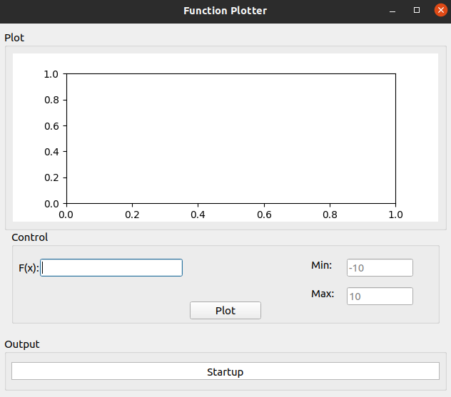
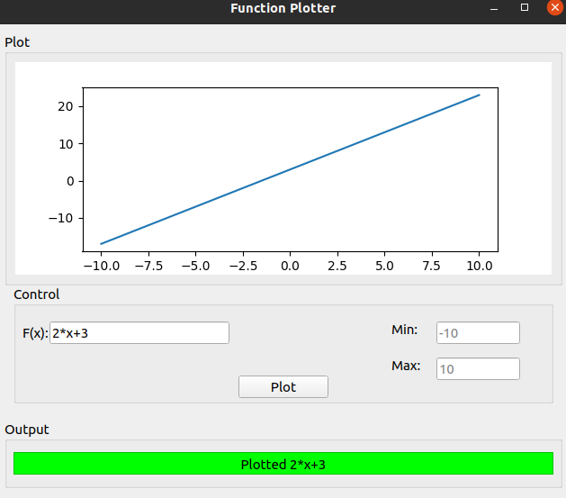
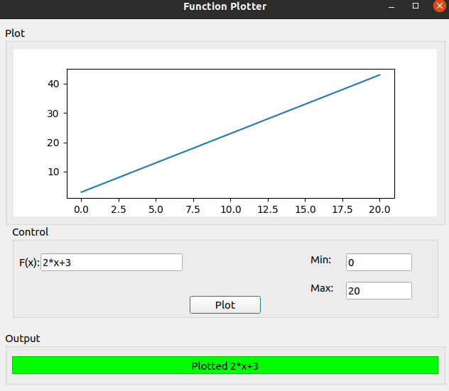
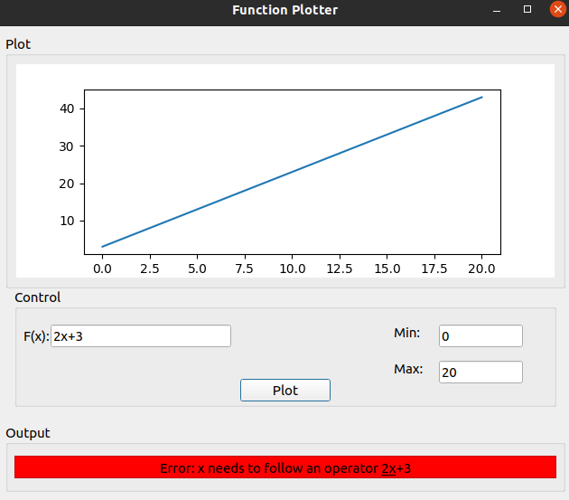
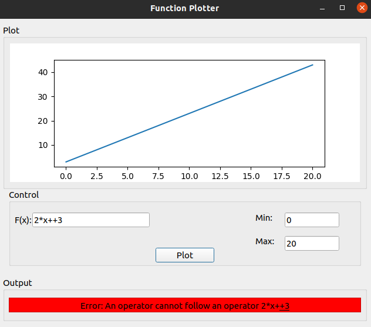

# Function Plotter
## Program
### Function evaluation
Function evaluation is usually a tricky task to do in efficient time, 1 or 2 passes. However, due to python's built in eval() function, this task is made much simpler. The task changes from being an algorithim problem to a preprocessing problem. We have to fit the user's syntax into python friendly syntax then evaluate the function using python's engine.

### Gui
Pyside2 was used for creating the gui. Qt-desginer was used to create the layout and minor modifications were added to the generated code to produce the functionality.

## Test cases
##### Test case 1: 
Successfull plot.

##### Test case 2: 
Successfull plot.

##### Test case 3:
Unsuccessfull plot. Syntax error.

##### Test case 4:
Unsuccessfull plot. Min max value error.

##### Test case 5:
Unsuccessfull plot. Syntax error.
